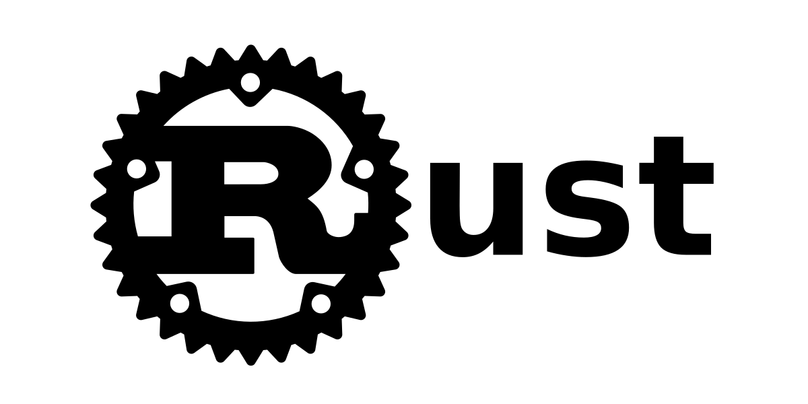

# Week 7 Mini Project: Rust Tool Packaging
## Eric Ortega Rodriguez 

## Project Overview
This project involves packaging a tool using Rust. The tool should include a user guide for installation and usage. Additionally, the project includes setting up a Continuous Integration/Continuous Deployment (CI/CD) pipeline that produces the Rust binary as an artifact.

Users can run the tool to multiply two predefined numbers (which can be customized in the code), and the output will display the result of the multiplication. In addition to showcasing the packaging of a Rust tool.

This project also includes a Continuous Integration/Continuous Deployment (CI/CD) pipeline using GitHub Actions. 
- This automates the build process, tests the code, and produces the binary artifact for distribution.

## Features
- Package a Rust tool.
- A user guide on how to install and use the tool.
- Continuous Integration/Continuous Deployment (CI/CD) pipeline that builds and packages the Rust binary.

